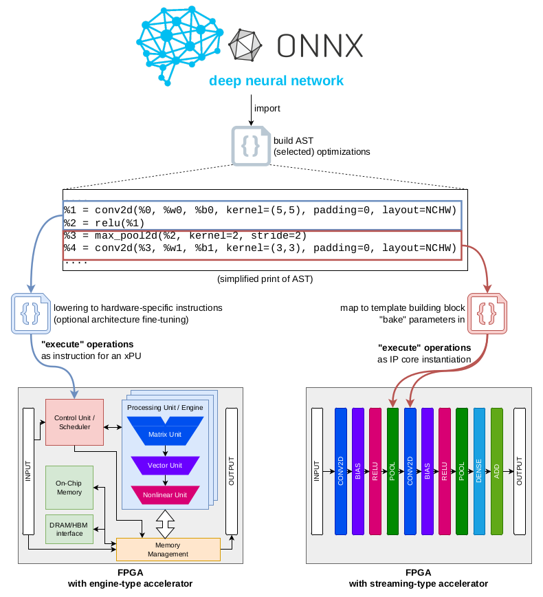

DOSA
========================
**IBM cloudFPGA Distributed Operator Set Architectures (DOSA) [version gradatim]**



About
----------------

The computational requirements of artificial intelligence workloads are growing exponentially. In addition, more and more compute is moved towards the edge due to latency or localization constraints. At the same time, Dennard scaling has ended and Moore’s law is winding down. These trends created an opportunity for specialized accelerators including field-programmable gate arrays (FPGAs), but the poor support and usability of today’s tools prevents FPGAs from being deployed at scale for deep neural network (DNN) inference applications.

Therefore, we propose an organic compiler — DOSA — that drastically lowers the barrier for deploying FPGAs. DOSA builds on the operation set architecture concept and integrates the DNN accelerator components generated by existing DNN-to-FPGA frameworks to produce an overall efficient solution. DOSA starts from DNNs represented in the community standard ONNX and automatically implements model- and data-parallelism, based on the performance targets and resource footprints provided by the user.

This repository contains the enhanced proof-of-concept implementation of this organic compiler principle that can compile and partition an ONNX to multiple FPGAs with just a one command. Currently, the `gradatim` version of DOSA supports the [hls4ml](https://github.com/cloudFPGA/hls4ml-for-dosa) and [VHDL4CNN](https://github.com/cloudFPGA/VHDL4CNN) libraries for building, and additional [VTA](https://tvm.apache.org/vta) for analysis. [ZRLMPI](https://github.com/cloudFPGA/ZRLMPI) is used as hardware-agnostic communication protocol. The FPGA binaries are built using the [cFDK](https://github.com/cloudFPGA/cFDK). 
Depending on the selected target device, the deployment of the  FPGA binaries requires access to the [IBM cloudFPGA platform](https://cloudfpga.github.io/Doc/index.html).

This DOSA version assumes that the weights in the ONNX *are already fully quantized* (by tools like e.g. [Brevitas](https://github.com/Xilinx/brevitas) or [Aimet](https://github.com/quic/aimet)). The corresponding number representation must be configured in the input constraints. 

More details of the supported libraries and flows are described in [./doc/DOSA_flow.md](./doc/DOSA_flow.md).
A detailed description of concepts and research behind DOSA can be found [here (Chapter 4)](https://doi.org/10.5281/zenodo.7957659).

Installation
-----------------

Basically: 
```bash
git clone --recurse-submodules https://github.com/cloudFPGA/DOSA.git
cd DOSA
virtualenv venv -p /usr/bin/python3.8
source venv/bin/activate
pip3 install -r requirements.txt
```
Besides this, DOSA requires `python3` and `llvm` development environment and a local installation of TVM. 
The detailed requirements as well as all steps to setup DOSA are described in [./doc/Install.md](./doc/Install.md). 

Usage
-----------------

### Compilation
General usage:
```commandline
./gradatim/main.py ./path/to/dosa_config.json ./path/to/nn.onnx ./path/to/constraint.json ./path/to/build_dir [--no-roofline|--no-build|--only-stats|--only-coverage]
```
The mandatory arguments are:
- `dosa_config.json`: JSON file containing the general configuration of DOSA. In most cases the **default configuration** in [./config/dosa_config_0.json](./config/dosa_config_0.json) is sufficient. 
- `nn.onnx`: The [ONNX](https://onnx.ai) of the DNN that should be compiled.
- `constraint.json`: The JSON file containing the target constraints. See examples in the [./examples/](./examples/) folder. 
- `path/to/build_dir/`: The path to the directory where the FPGA build files should be emitted to. How to handle non-empty build directories can be configured in the `dosa_config.json`. 

The optional arguments are:
- `--no-roofline`: Deactivates the display of the Roofline analysis (could be up to 30 windows).
- `--no-build`: Deactivates the generation of build files and just the Roofline analysis is shown.  
- `--only-stats`: DOSA emits only the architecture draft including its characteristics. No build files are generated and no Roofline anlaysis is shown.
- `--only-coverage`: DOSA emits only the coverage of each OSG of the given ONNX. No build files are generated, no Roofline anlaysis is shown, and no architecture draft is generated. 

*Only one optional argument is allowed!*
As default, DOSA shows the Roofline analysis, generates the build files, and prints the high-level architecture draft. 

### Build

After DOSA finished, the build of all FPGA binaries can be invoked with 
```bash
cd path/to/build_dir/
# source build tools requirements, e.g. Vivado/Vitis/...
./dosa_build.sh
# the build processes are started in a tmux, to view them
tmux at
```

### Deployment

The deployment is platform specific, of course. However, if supported by the target platform, DOSA wraps the necessary commands in the script `dosa_deploy.py` in the `build_dir`. 

### Examples

The [./examples/](./examples/) folder contains some ONNX files and their corresponding constraints. 

For example, to show the Roofline analysis of the PTTCNN example (CNN fom the [pytorch tutorial](https://pytorch.org/tutorials/beginner/blitz/cifar10_tutorial.html)) without generating build files, execute the following command: 
```bash
. venv/bin/activate
./gradatim.sh ./config/dosa_config_0.json ./examples/PTTCNN_int8.onnx ./examples/PTTCNN_meta.json ./my_build_dirs/pttcnn/ --no-build
# maybe `export PYTHONPATH=.` is necessary before
```

Citation
-----------------

If you use this software in a publication, please cite our two papers introducing Operation Set Architectures and explaining DOSA:

```
@Article{CAL_OSA,
  author   = {Ringlein, Burkhard and Abel, Francois and Diamantopoulos, Dionysios and Weiss, Beat and Hagleitner, Christoph and Fey, Dietmar},
  journal  = {IEEE Computer Architecture Letters},
  title    = {{Advancing Compilation of DNNs for FPGAs using Operation Set Architectures}},
  year     = {2023},
  issn     = {1556-6064},
  month    = jan,
  number   = {1},
  pages    = {9--12},
  volume   = {22},
  doi      = {10.1109/LCA.2022.3227643},
  url      = {https://ieeexplore.ieee.org/document/9984183/},
}

@InProceedings{EDGE_DOSA,
  author   = {Ringlein, Burkhard and Abel, Francois and Diamantopoulos, Dionysios and Weiss, Beat and Hagleitner, Christoph and Fey, Dietmar},
  booktitle = {Proceedings of the 2023 IEEE International Conference On Edge Computing & Communications (EDGE 2023))},
  title     = {{DOSA: Organic Compilation for Neural Network Inference on Distributed FPGAs}},
  year      = {2023},
  address   = {Chicago, Illinois},
  month     = jul,
  pages     = {43--50},
  publisher = {IEEE},
  date      = {2-8 July 2023},
  doi       = {10.1109/EDGE60047.2023.00019},
}

```


License
-----------------

DOSA is released under the Apache 2.0 License.


Structure of this repository
--------------------------------

- [config/](./config/): Contains the default configurations for DOSA.
- [db/](./db): Contains resource databases needed by some OSGs.
- [gradatim/](./gradatim): The python package containing the DOSA compiler (version gradatim).
- [doc/](./doc): Contains some documentation.
- [examples/](./examples): Contains some example DNNs with their constraint files.
- [scripts/](./scripts): Contains further scripts helping to use DOSA.
- [setup/](./setup): Contains files required during installation.
- [gradatim.sh](./gradatim.sh): A script invoking DOSA.


* * *
Trivia: The second version of DOSA is named after the Latin word for "one step after the other".
(The first version of DOSA was named after one popular [exoplanet](https://en.wikipedia.org/wiki/Dimidium) while at the same time meaning "half" in Latin.)

