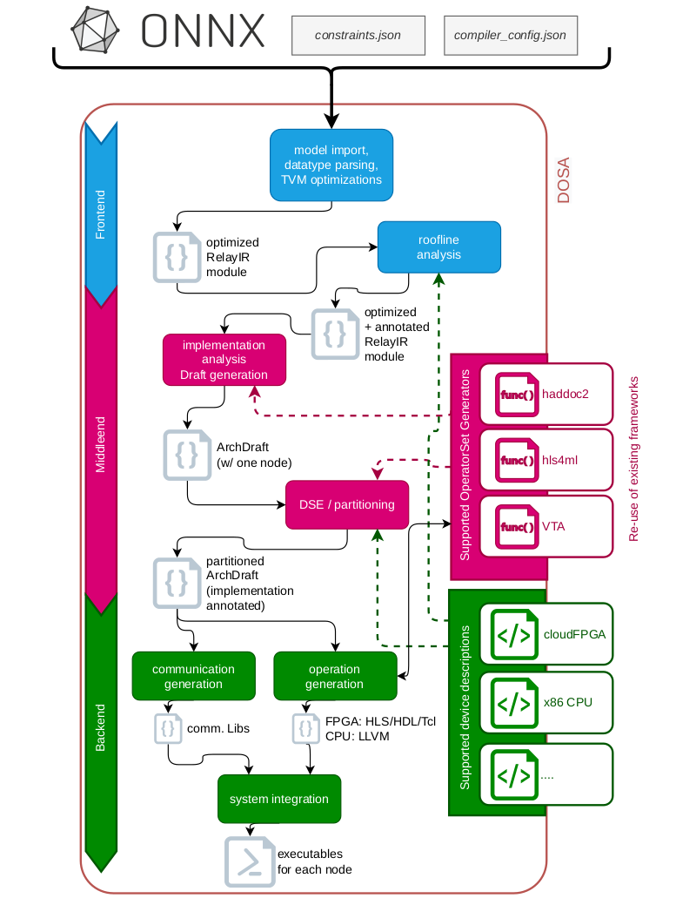
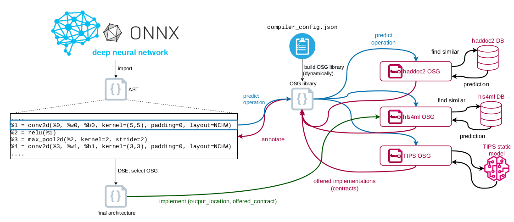

DOSA: Some details on the flow
==================================

Our ambition is to create an “organic compiler” that can automatically compile DNN models
to distributed FPGA platforms, including the automatic decision about which architecture
template with which framework for which part of the DNN should be used. Furthermore,
we explicitly aim for distributed architectures across a heterogeneous cluster.

Overview of the flow
----------------------

The overall DOSA flow is depicted below: 

Operation Set Architectures
-------------------------------

The foundation of organic compilation is to combine multiple specialized-but-narrow frameworks into a single holistic compiler. 
This requires a compiler that can reason about different parts of the DNN, different devices, and different frameworks in an unified way. 
To achieve this goal, we build on our recently proposed [Operation Set Architecture (OSA)](https://ieeexplore.ieee.org/abstract/document/9984183), a concept than enables the architecture-agnostic optimization of a DNN and subsequently the selection of the best implementation among multiple possibilities. 
This basic principle is shown below.

Using the OSA, an Abstract Syntax Tree (AST) is built from the imported DNN and simple optimizations are executed. Additionally, the AST is lowered to an intermediate representation (IR) that allows to handle small-enough but still “meaningful” operations.
This way, common optimizations are executed at higher-level abstractions, while the decision for the architecture layout or framework is taken at this level. 
Following this approach, OSAs aim to combine the advantages of both worlds: 
On the one hand, leveraging the vast set of optimizations of classical compilers using ASTs, enabled by the simplification of the DNN to a lower IR. On the other hand, OSAs do not loose the flexibility to create customized data-flow architectures because they do not break down the complete target application into too narrow intermediate instructions too early. 
This last point is important, for two reasons: First, if a target application, e.g. a DNN, is already broken down to only multiply and add instructions, it is complex and error-prone to map these low-level instructions to an FPGA IP core that could execute this list of instructions as e.g. one 2D convolution (cf. polyhedral-based compilation techniques). 
Second, operations with a high-level of abstraction are more likely to be implemented as efficient custom data-flow architectures. 
Additionally, the abstraction level provided by OSAs enable partitioning decisions at likewise “meaningful” steps of the application. This allows the implementation of a fast Design-Space Exploration (DSE).

Implementing Automatic Reuse: Operator Set Generators (OSGs)
---------------------------------------------------------------

One key ingredient necessary for our envisioned organic compiler is a mechanism to interface with all kinds of different specialist frameworks in order to reuse them and not be forced to “re-invent the wheel” again. 
This interfacing is necessary for two steps: First, getting predictions for all operations in a DNN. And second, to then implement a selected operation. 

Hence, we decided to design an intermediate layer between our meta-compiler and the individual specialist frameworks. This intermediate layer is called *Operator Set Generator* (OSG) and is sketched in the Figure above. 
After importing the DNN and building and optimizing the AST, the meta-compiler traverses the AST and asks each OSG foreach operation to characterize possible implementations, as shown on the left hand side of the Figure. 
Since the OSGs act only as adapters, no information represented in the AST is lost. 
As can be seen on the right hand side of the Figure, foreach specialist-framework there exists a corresponding OSG. 
How each OSG is implemented is up to the vendor of the OSG, as long as the OSG implements the (inherited) interface of `predict` and `implement`. 
For example, the `haddoc2` and `hls4ml` OSG use historic data to predict the performance and resource numbers, whereas the VTA OSG uses a staticmodel. 
Subsequently, during the AST annotation step each OSG returns the possible implementations with their characteristics in a data structure called `Contract`.
Such a contract contains all the promised performance and resource characteristics and can also be extended to contain OSG specific parameters. 
This is useful if some OSGs can offer multiple implementations with different characteristics for the same operation. 
Of course, OSGs can also return no offered implementations, if the operation or the targeted deviceis not supported. 
Later in the flow, as shown at the bottom of the Figure, after the DSE decided which offered implementation to choose, the selected contract is returned to the corresponding OSG along with an individual output directory and the OSG is asked to implement this operation(s). 
Please note that the OSG library in the center at the top of the Figure is not static but created dynamically upon each invocation of the compiler. Hence, we enable the user to add custom OSGs via a global configuration file. 

Supported Target Platforms (as of today)
------------------------------------------

The supported devices can be found in [gradatim/backend/devices/builtin.py](../gradatim/backend/devices/builtin.py). 
Currently, DOSA supports multiple target devices for analysis and (simulated) partitioning and the generation of build files is implemented (and demonstrated) for the [IBM cloudFPGA platform](https://github.com/cloudFPGA). 

To deploy FPGA binaries there, [access to the cloudFPGA platform](https://cloudfpga.github.io/Doc/index.html) is required. To test access and the deployment of files, we recommend testing the [partial reconfiguration flow on cloudFPGA](https://cloudfpga.github.io/Doc/pages/GETTING_STARTED/getting_started.html#how-to-partial-reconfiguration). 

Further devices can be added by implementing the `DosaDevice` interface, which can be found in [gradatim/backend/devices/dosa_device.py](../gradatim/backend/devices/dosa_device.py). 
Utilities like the [`VhdlEntity`](../gradatim/backend/codeGen/VhdlEntity.py) or the [`WrapperInterfaces`](../gradatim/backend/codeGen/WrapperInterfaces.py) classes are then used automatically.

